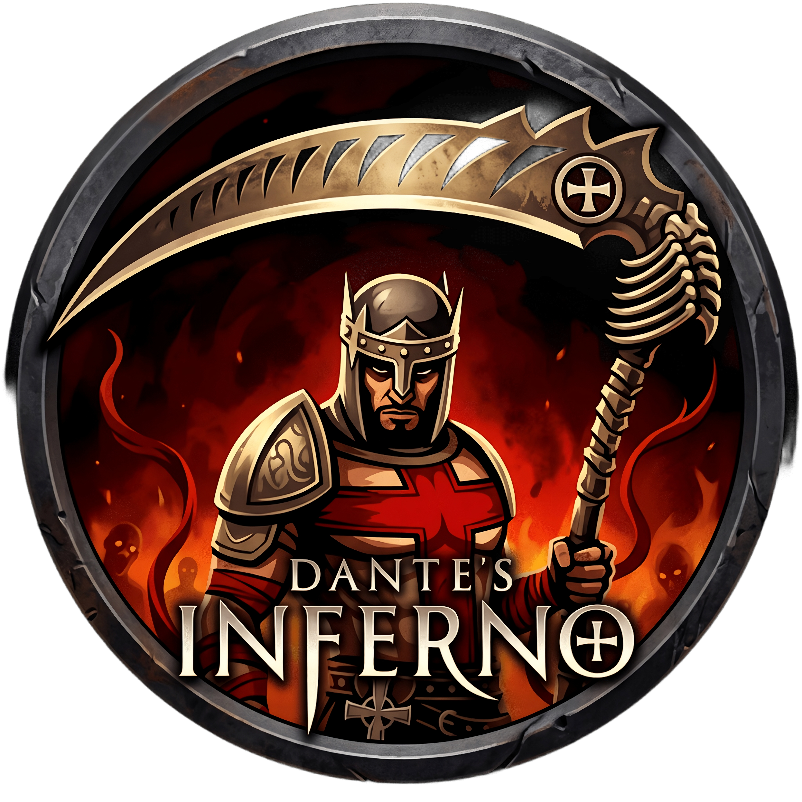

# Dante's Inferno - Android Port (ARM64 / Vulkan)

<p align="center">
  
</p>

<p align="center">
  <em>Fan artwork by <a href="https://www.deviantart.com/pooterman">POOTERMAN</a> (<a href="https://github.com/florinp93/hells-gate-recomp/issues/12">#12</a>)</em>
</p>

<p align="center">
  
  
  
  
</p>

A static recompilation port of **Dante's Inferno** (Xbox 360) running natively on **Android (ARM64-v8a)**, powered by the [ReXGlue SDK](https://github.com/rexglue/rexglue-sdk), SDL3, and Turnip/Mesa Vulkan drivers via AdrenoTools.

Unlike traditional emulation or JIT runtimes, static recompilation translates Xbox 360 PowerPC XEX binaries directly into optimized native AArch64 machine code ahead of time.

---

## ⚡ Key Features

- **Native AArch64 Execution**:
  - Over 20,000+ guest PPC functions translated directly into native ARM64 C++ with `-O3` vectorization.
  - Accelerated AltiVec SIMD execution via custom native ARM64 NEON intrinsics (`vmaxq_f32`, `vcvtq_*`, `vqtbl1q_u8`, `vrhaddq_*`, etc.).
  - Big/Prime CPU core unpinning (`ignore_thread_affinities = true`) to unleash Qualcomm Kryo / Cortex-A7xx / Cortex-X cores.
  - Speculative execution throttling using hardware `YIELD` instructions to prevent overheating and thermal throttling.

- **Vulkan & AdrenoTools Turnip Integration**:
  - Direct Vulkan rendering backend with support for custom Mesa/Turnip GPU driver loading via AdrenoTools.
  - Persistent on-disk Mesa shader cache (`MESA_DISK_CACHE_SINGLE_FILE=1`) and async pipeline compilation.
  - Adreno 7xx/8xx stability optimizations (sparse shared memory & push constant descriptor workarounds).

- **Instant Zero-Copy ISO Loading**:
  - Direct ISO mounting through the Android Storage Access Framework (SAF) using native detached file descriptors (`/proc/self/fd/<fd>`).
  - No 7.8 GB duplication or lengthy extraction required. An integrated XDVDFS extractor is also available.

- **Native AAudio Engine**:
  - Low-latency, underrun-safe audio pipeline backed by Android AAudio (`AAUDIO_USAGE_GAME`).
  - 4096-frame safety buffer preventing audio stuttering across diverse SoC audio DSPs.

- **Display & HUD Enhancements**:
  - 60.0 Hz display mode pinning with Auto Low Latency Mode (ALLM) to eliminate frame pacing judder.
  - Real-time guest hardware FPS & frametime overlay hooked directly into the guest GPU swapchain (`VdSwap`).
  - Ultrawide Hor+ projection hook preventing geometry distortion on 20:9, 21:9, and foldable mobile screens.

- **Modern Android Integration**:
  - In-app GitHub update checker and APK installer (`AppUpdater`).
  - Fully compliant with **16 KB page size** memory layouts (Android 15+).
  - Out-of-process clean relaunch (`:restart`) when swapping GPU drivers and cvars.

---

## 📱 System Requirements

| Requirement | Minimum | Recommended |
|---|---|---|
| **OS** | Android 8.0 (API 26) | Android 11+ (API 30+) |
| **Architecture** | 64-bit ARM (`arm64-v8a`) | ARMv8.2-A / ARMv9 with Cortex-X cores |
| **SoC** | Snapdragon 845 / 855 | Snapdragon 870 / 8 Gen 1 / 8 Gen 2 / 8 Gen 3 |
| **GPU** | Adreno 6xx with Vulkan 1.1+ | Adreno 7xx / 8xx with Turnip drivers |
| **RAM** | 4 GB | 6 GB or higher |
| **Storage** | ~8 GB free space for ISO | High-speed UFS 3.0+ internal storage |

> [!NOTE]
> Mali / Immortalis / PowerVR / Xclipse GPUs can run via system Vulkan, but custom Turnip drivers are specific to Qualcomm Adreno hardware.

---

## 🎮 How to Play

1. **Download the APK**: Grab the latest release from the [Releases](https://github.com/florinp93/dantes-inferno/releases) tab.
2. **Install**: Install the APK on your Android device and grant necessary storage permissions.
3. **Provide the Game**:
   - Obtain a legal backup of **Dante's Inferno (Xbox 360)** in `.iso` format.
   - Launch the app, tap **Select ISO**, and pick your ISO file using the system file picker.
4. **Configure & Launch**:
   - In Settings, select your preferred Turnip GPU driver (for Snapdragon devices), toggle the Performance Overlay, or adjust visual cvars.
   - Tap **Launch Game** to play.

---

## 🛠️ Building from Source

### Prerequisites

- **Android Studio** or **Android Command Line Tools**
- **Android SDK** (Target API 34, Compile API 34)
- **Android NDK**: `26.1.10909125`
- **CMake**: `3.22.1+`
- **JDK**: Java 17
- **Python**: 3.10+

### Build Steps

1. **Clone the repository**:
   ```bash
   git clone --recursive https://github.com/florinp93/dantes-inferno.git
   cd dantes-inferno
   ```

2. **Apply generated code patches**:
   ```bash
   python3 patches/generated/apply_generated_patches.py
   ```

3. **Build the Release APK**:
   ```bash
   cd android
   chmod +x gradlew
   ./gradlew assembleRelease
   ```

The compiled APK will be located at:
```
android/app/build/outputs/apk/release/app-release.apk
```

---

## 📂 Project Structure

```
.
├── android/                       # Android app module (Gradle, JNI, Java/Kotlin)
│   ├── app/src/main/
│   │   ├── java/com/dantesinferno/game/  # TitleActivity, MainActivity, Settings, AppUpdater
│   │   └── res/                          # Layouts, icons, and themes
│   └── gradlew                    # Gradle wrapper
├── generated/                     # Statically recompiled C++ code (114 units)
│   ├── default/                   # codegen PPC->C++ units + setjmp unwind patches
│   └── rexglue.cmake              # Generated build configuration
├── src/                           # Custom C++ game logic & hooks
│   ├── dantes_inferno_app.h       # ReXApp hook overrides (cvars, paths, display)
│   └── dantes_inferno_hooks.h     # guest mid-asm hooks (fiber setjmp, ultrawide)
├── thirdparty/
│   ├── rexglue-sdk/               # ReXGlue SDK (PPC runtime, kernel shims, AltiVec NEON)
│   └── adrenotools/               # Custom GPU driver loading library
├── patches/                       # Patches for SDK and generated code
│   └── generated/apply_generated_patches.py
├── tools/                         # Profiling & asset utilities
│   ├── bench.sh                   # Compositor-level SurfaceFlinger benchmark tool
│   └── asset_tool.py              # BIG/STR/TG4D/VP6 asset tool
└── .github/workflows/             # Automated CI/CD release workflows
```

---

## 🤖 AI Usage Disclosure

Transparency and integrity are important to this project. Artificial Intelligence (AI) tools were utilized as part of the development and maintenance workflow, strictly serving as an assistant to handle repetitive, time-consuming, and low-level tasks (documentation drafts, API investigations, routine boilerplate, and commit maintenance). All architectural decisions, performance tuning, and code modifications were carefully engineered and verified.

---

## ⚖️ Legal & Disclaimer

This project is an open-source static recompilation wrapper for educational and preservation purposes. 
- No copyrighted game assets, executables, or proprietary code are included or distributed in this repository.
- To play the game, you must provide your own legally acquired copy of *Dante's Inferno* for Xbox 360.
- All trademarks and game content belong to their respective owners.

